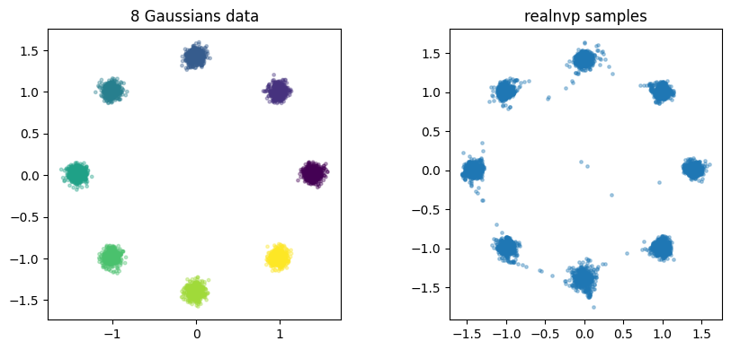
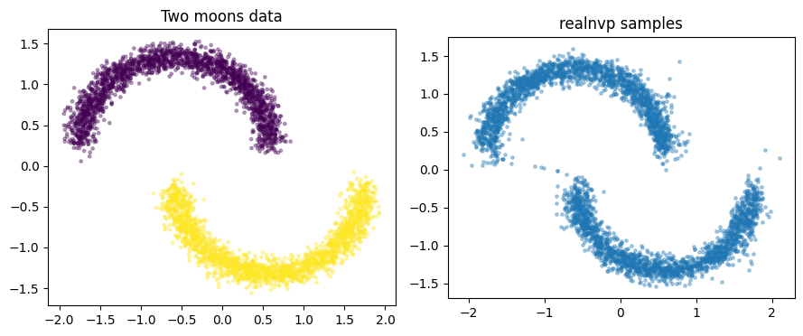
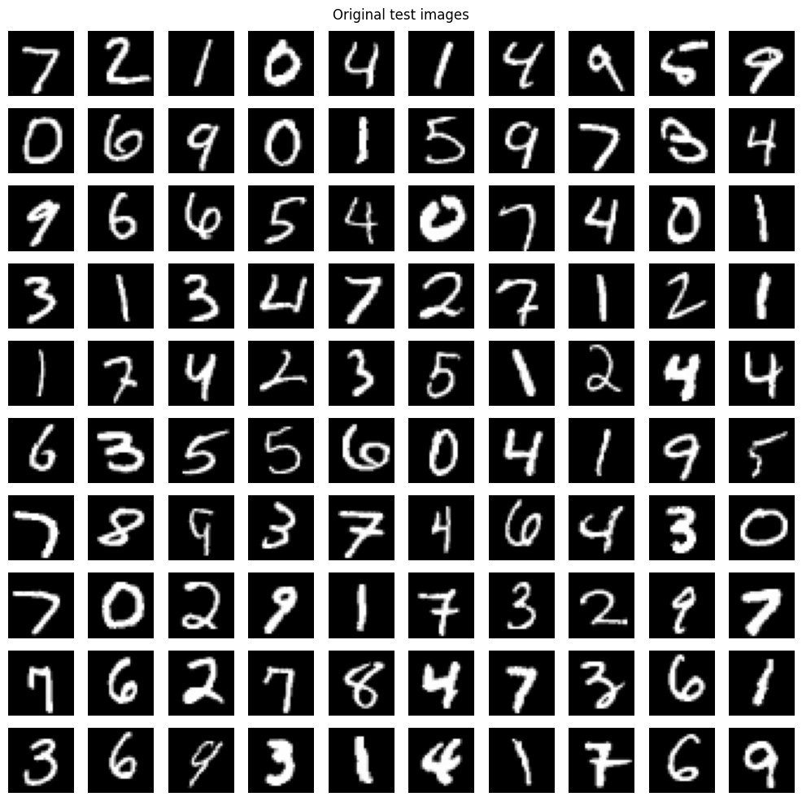
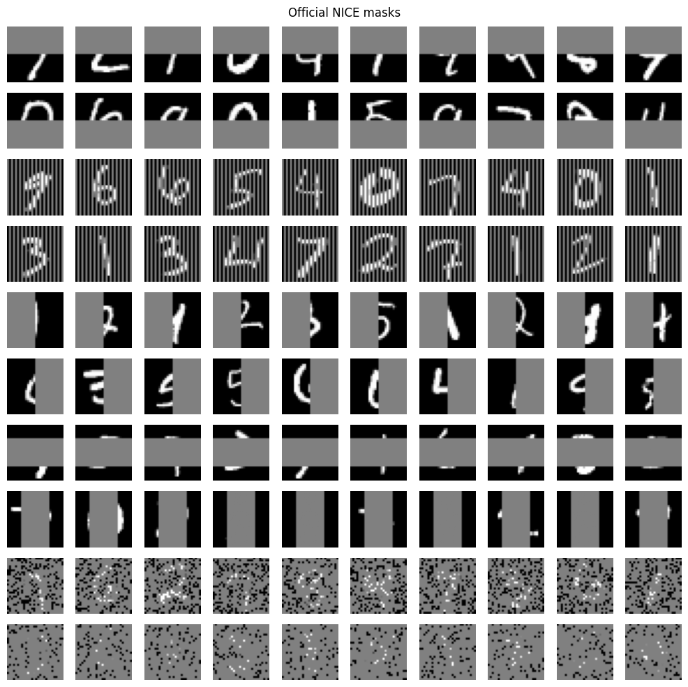
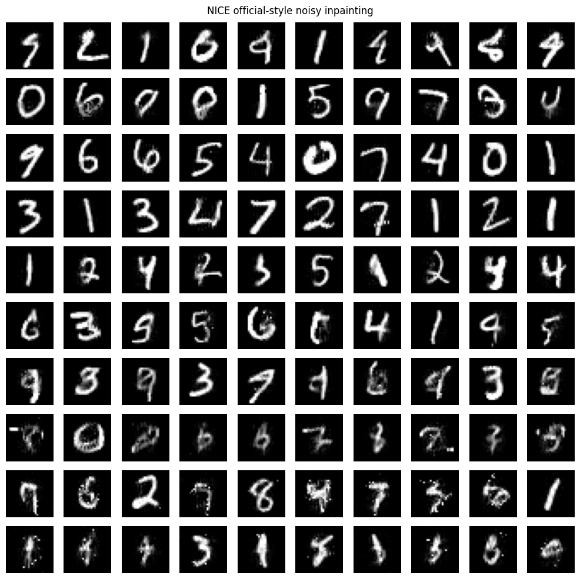

# vect_micrograd normalizing flows

<p align="center">
  
  
</p>

<p align="center">
  
  
    
</p>


A compact, educational implementation of normalizing flows using a vectorized
NumPy micrograd [vect_micrograd](https://github.com/pvilanova/vect_micrograd). 

The repository currently focuses on two coupling-flow families:

- **NICE** — additive coupling layers plus a final learned diagonal scaling
  layer.
- **Real NVP-style affine flows** — affine coupling layers with input-dependent
  log-determinants.

The code is intended for learning, experimentation, and small reproductions.  It
is not meant to compete with PyTorch/JAX/Theano for performance on large models.

## Quickstart

```bash
pip install -e .
python -m pytest -q
```

## Repository layout

```text
vect_micrograd/
  vect_engine.py   # vectorized NumPy autograd engine
  vect_nn.py       # small neural-network layers used inside couplings
  flows.py         # priors, coupling layers, scaling, permutations, flow API
  optim.py         # SGD, Adam, Lion, RMSProp, NICE/Pylearn2 momentum schedule
  utils.py         # training/checkpoint/diagnostic helpers

tests/
  test_value.py
  test_flows.py
  test_optim.py

flow_two_moons_micrograd.ipynb
flow_8_gaussians_micrograd.ipynb
flow_mnist_nice_rmsprop_micrograd.ipynb
1410.8516v6.pdf
```

## Autograd engine notes

`vect_micrograd/vect_engine.py` keeps the micrograd design: operations create a
dynamic DAG and `backward()` performs reverse-mode autodiff over that DAG.  The
main difference from scalar micrograd is that each node contains a NumPy array.

The current engine includes a few practical optimizations that matter for the
flow notebooks:

- lazy gradient allocation: intermediate `Value.grad` buffers are allocated only
  when a backward contribution arrives;
- a fast backward path for ordinary slicing such as `x[:, :d]`, which is heavily
  used by coupling layers;
- safe fallback behavior for advanced indexing through `np.add.at`;
- standard NumPy broadcasting-aware gradient accumulation.

Because this is still a dynamic Python autograd engine, long training runs and
pixel-space inpainting are much slower than compiled autodiff systems.  Small
floating-point differences can also be amplified by long optimization runs, so
fixed random seeds make runs reproducible in practice but should not be expected
to guarantee bitwise equality across engine revisions, BLAS settings, or Python
processes.

## Flow API

The code is organized around reusable flow components rather than a single
monolithic model class.

```text
base distribution + invertible transform stack = normalizing flow
```

Core components include:

- `StandardNormal`
- `StandardLogistic`
- `AdditiveCoupling`
- `AffineCoupling`
- `DiagonalScaling`
- `Reverse`
- `Permute`
- `FlowSequential`
- `NormalizingFlow`
- `make_nice_flow(...)`
- `make_realnvp_flow(...)`
- `make_flow(kind=...)`

Each transform follows the same convention:

```python
z, logdet = transform.forward(x)
x = transform.inverse(z)
params = transform.parameters()
```

`NormalizingFlow` provides the density-model interface:

```python
logp = model.log_prob(x)  # per-example log p(x), shape (batch,)
loss = model.nll(x)       # mean negative log-likelihood, scalar Value
x = model.sample(1024)    # NumPy samples generated by the inverse flow
```

## NICE

NICE uses additive coupling layers.  One part of the input is copied unchanged,
and the other part is shifted by a neural network conditioned on the copied part:

```text
y_id     = x_id
y_change = x_change + t(x_id)
logdet   = 0
```

Because additive coupling is volume-preserving, a final learned diagonal scaling
layer supplies a global log-determinant:

```text
z = exp(s) * h
log |det J| = sum_i s_i
```

Example:

```python
from vect_micrograd.flows import make_nice_flow
from vect_micrograd.optim import Adam

model = make_nice_flow(
    dim=2,
    hidden_sizes=(64, 64),
    num_coupling_layers=4,
    prior="normal",
)

optimizer = Adam(model.parameters(), lr=5e-4)
```

## Real NVP-style affine coupling

Real NVP-style affine coupling extends the NICE coupling transform by adding an
input-dependent scale:

```text
y_id     = x_id
y_change = x_change * exp(s(x_id)) + t(x_id)
logdet   = sum_j s_j(x_id)
```

This gives the model local compression and expansion.  In the toy notebooks,
affine coupling usually fits two moons and eight Gaussians better than pure
additive NICE.

Example:

```python
from vect_micrograd.flows import make_realnvp_flow
from vect_micrograd.optim import Adam

model = make_realnvp_flow(
    dim=2,
    hidden_sizes=(64, 64),
    num_coupling_layers=6,
    prior="normal",
    max_log_scale=2.0,
)

optimizer = Adam(model.parameters(), lr=5e-4)
```

A final diagonal scaling layer can also be added to affine models:

```python
model = make_realnvp_flow(
    dim=2,
    hidden_sizes=(64, 64),
    num_coupling_layers=6,
    use_final_scaling=True,
)
```

## Generic builder

The toy notebooks use the generic builder so the same training loop can switch
between additive NICE and affine Real NVP-style coupling:

```python
from vect_micrograd.flows import make_flow

flow_kind = "realnvp"  # or "nice"

model = make_flow(
    kind=flow_kind,
    dim=2,
    hidden_sizes=(64, 64),
    num_coupling_layers=6,
    prior="normal",
    max_log_scale=2.0,
)
```

For `kind="nice"`, pass only options accepted by `make_nice_flow`.  For
`kind="realnvp"`, pass affine-specific options such as `max_log_scale`.

## Minimal training loop

```python
import numpy as np

from vect_micrograd.flows import make_realnvp_flow
from vect_micrograd.optim import Adam

rng = np.random.default_rng(0)
X = rng.standard_normal((4096, 2)).astype(np.float32)

model = make_realnvp_flow(dim=2, hidden_sizes=(64, 64), num_coupling_layers=4)
optimizer = Adam(model.parameters(), lr=5e-4, weight_decay=0.0)

for step in range(2000):
    idx = rng.integers(0, len(X), size=256)
    loss = model.nll(X[idx])

    optimizer.zero_grad()
    loss.backward()
    optimizer.step(step)

samples = model.sample(1024)
print("final minibatch NLL:", float(loss.data))
print("sample shape:", samples.shape)
```

## Demo notebooks

### `flow_two_moons_micrograd.ipynb`

Trains a 2-D flow on the two-moons dataset.  The notebook is useful for seeing
why affine coupling is often more expressive than additive coupling on curved toy
densities.

### `flow_8_gaussians_micrograd.ipynb`

Trains a 2-D flow on the standard eight-Gaussians ring dataset.  This is a good
stress test for multimodality and mode coverage.

### `flow_mnist_nice_rmsprop_micrograd.ipynb`

Trains an additive NICE model on continuously dequantized MNIST.  The notebook
uses:

- 50,000 training images and 10,000 validation images from the MNIST training
  split;
- fresh dequantization noise for every training minibatch;
- fixed validation/test dequantization arrays;
- odd/even input ordering followed by additive coupling layers;
- a final diagonal scaling layer;
- a logistic prior;
- `RMSProp` with NICE/Pylearn2-style momentum, denominator floor, and learning
  rate decay.

The final section implements official-style NICE inpainting based on Laurent
Dinh's `pylearn2/scripts/reconstruct_mnist_gif.py`: noisy gradient ascent on the
missing pixels with observed pixels copied back after every update.  The original
script uses `sqrt_iter=70`, which means 111,895 pixel-update steps.  In this
micrograd implementation, smaller values such as 30--40 are more practical for
quick tests; the full 100-image mask layout remains available through a flag in
the notebook.

## Optimizers

`vect_micrograd.optim` includes several simple optimizers.  The MNIST notebook
uses the `RMSProp` implementation with options chosen to match the NICE/Pylearn2
style as closely as this project intends:

```python
from vect_micrograd.optim import RMSProp, epoch_momentum

optimizer = RMSProp(
    model.parameters(),
    lr=1e-3,
    rho=0.95,
    eps=1e-2,
    eps_mode="max",
    min_lr=1e-4,
    lr_decay_factor=1.0005,
)

# in the epoch loop
optimizer.step(global_step, momentum=epoch_momentum(epoch))
```

With these settings the update is:

```text
avg      = rho * avg + (1 - rho) * grad**2
denom    = max(sqrt(avg), eps)
velocity = momentum * velocity - lr * grad / denom
param    = param + velocity
```

## References

- Laurent Dinh, David Krueger, and Yoshua Bengio.  
  **NICE: Non-linear Independent Components Estimation.**  
  arXiv:1410.8516, 2014.  
  https://arxiv.org/abs/1410.8516

- Laurent Dinh, Jascha Sohl-Dickstein, and Samy Bengio.  
  **Density Estimation using Real NVP.**  
  arXiv:1605.08803, 2016.  
  https://arxiv.org/abs/1605.08803

- Laurent Dinh.  
  **Official NICE implementation.**  
  https://github.com/laurent-dinh/nice
